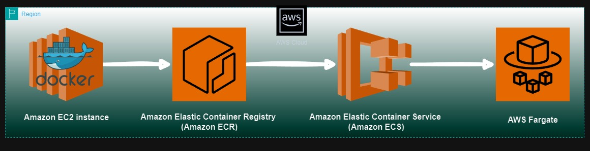

## ECS-Fargate

## Project Title: Serverless Cloud-Native Web Deployment with Docker Containerization, AWS ECR, and AWS Fargate.

#### Project Architecture:

#### Project Description:

In this project, I demonstrated my ability to deploy a sample CSS website using Docker, AWS EC2, ECR, and ECS with Fargate. The project involved the following steps:

1. **Setup and Preparation**:
   - Downloaded the sample CSS website files.
   - Created a Dockerfile in the project directory to containerize the website.

2. **AWS EC2 Instance Configuration**:
   - Launched an EC2 instance and installed Docker and AWS CLI on it.
   - Used the `scp` command along with a pem key to securely transfer the website files from my local machine to the EC2 instance.

3. **Docker Image Creation and ECR Integration**:
   - Built a Docker image from the transferred website files on the EC2 instance.
   - Created a repository in Amazon Elastic Container Registry (ECR).
   - Authenticated and pushed the Docker image to the ECR repository.

4. **AWS ECS and Fargate Deployment**:
   - Used Amazon Elastic Container Service (ECS) to create a cluster using the Fargate launch type.
   - Defined a task in ECS with the Docker image from the ECR repository, configuring it to map the container's port 80.
   - Created a service in the ECS cluster based on the task definition, which deployed the container.

5. **Infrastructure Management and Access**:
   - Managed the infrastructure using AWS Fargate, a serverless compute engine for containers.
   - Ensured the task was successfully created, deployed, and running.
   - Verified that the website was accessible using the provided public IP on port 80.

This project showcases my proficiency in AWS services, containerization with Docker, and managing deployments using ECS and Fargate, emphasizing my ability to deliver scalable and serverless solutions.

### AWS and DevOps Relevance:
This project highlights several core principles of AWS and DevOps practices:

+ **AWS Integration:** Utilizes multiple AWS services (EC2, ECR, ECS, and Fargate) to create a seamless, scalable, and serverless deployment.
+ **Containerization:** Demonstrates the use of Docker for containerizing applications, which is essential for consistent and portable deployment across different environments.
+ **Deployment:** Shows the deployment process using AWS CLI and Docker commands, reducing manual intervention and potential for errors.
+ **Scalability:** Leverages AWS Fargate to provide serverless compute resources, ensuring the application can scale seamlessly based on demand.